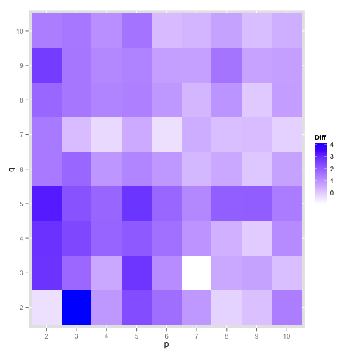
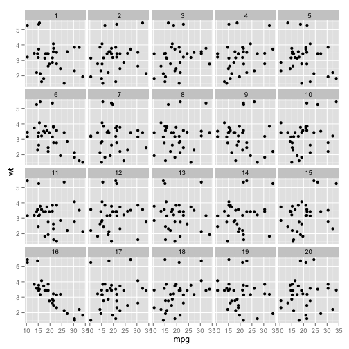
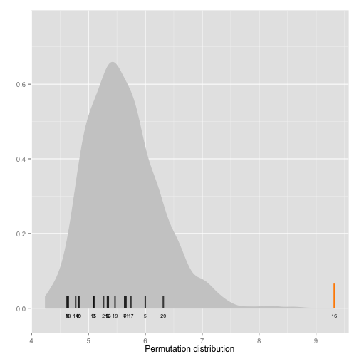

<!--
%\VignetteEngine{knitr::docco_linear}
%\VignetteIndexEntry{An Introduction to the nullabor package}
-->

An Introduction to **nullabor** package
=======================================


Introduction
------------


The  **nullabor** package provides a method of generating lineup plots by randomly placing the true plot among a set of null plots for a given null generating mechanism. This package also provides distance metrics to calculate the distance between the plots in a lineup. The diagonostic plots to compare one lineup to some other lineups can also be drawn.


Distance metrics
----------------------------
There are five different distance metrics in **nullabor** package, named `"bin_dist"`, `"box_dist"`, `"reg_dist"`, `"sep_dist"` and `"uni_dist"`. The different distance metrics are constructed so that they can identify the different properties of the data. `"uni_dist"` works for univariate data while the others works for all types of bivariate data. Binned distance is a generic distance which can be used in any situations while the other distance metrics are constructed so that they can identify the effect of graphical elements in a plot like an overlaid regression line or presence of defined clusters. To calculate some of the metrics, additional informations like a class variable or the number of bins should be provided.

Distance for univariate data
-----------------------------------------------------

`"uni_dist"` is a distance metric which calculates the euclidean distance between the first four central moments of two univariate data. A typical usage would be when one needs to calculate the distance between the two histograms drawn from two datasets.


```r
library(nullabor)
```

```
## Loading required package: ggplot2
```

```
## Warning: replacing previous import by 'reshape::rename' when loading 'nullabor'
## Warning: replacing previous import by 'reshape::round_any' when loading 'nullabor'
```

```r
uni_dist(rnorm(100), rpois(100, 2))
```

```
## [1] 2.506
```


Distance based on regression parameters
-----------------------------------------------------

`"reg_dist"` is a distance metric which calculates the euclidean distance between the regression parameters of a model fitted to one plot and that of another plot. It is advisable to use this distance in situations where a regression line is overlaid on a scatterplot.


```r
with(mtcars, reg_dist(data.frame(wt, mpg), data.frame(sample(wt), mpg)))
```

```
## [1] 521.7
```


Distance based on boxplots
-----------------------------------------------------

`"box_dist"` is a distance metric which works for side-by-side boxplots with two levels. The first quartile, median and the third quartile are calculated for each box and the absolute distances of these are calculated for the two boxes. `"box_dist"` calculates the euclidean distance between these absolute distances for the two plots.  The boxplot distance should be used in situations where a side-by-side boxplot is used to compare the distribution of a variable at two different levels.


```r
with(mtcars, box_dist(data.frame(as.factor(am), mpg), data.frame(as.factor(sample(am)), 
    mpg)))
```

```
## [1] 10.99
```


Distance based on separation
------------------------------------------------------

`"sep_dist"` is a distance metric based on the separation between clusters. The separation between clusters is defined by the minimum distances of a point in 
the cluster to a point in another cluster. The separation between the clusters for a given dataset is calculated. An euclidean distance is calculated between the separation for the given dataset and another dataset. The number of clusters in the dataset should be provided. If not, the hierarchical clustering method is used to obtain the clusters.


```r
with(mtcars, sep_dist(data.frame(wt, mpg, as.numeric(as.factor(mtcars$cyl))), 
    data.frame(sample(wt), mpg, as.numeric(as.factor(mtcars$cyl))), nclust = 3))
```

```
## [1] 1.574
```

Binned Distance
-----------------------------------------------------

`"bin_dist"` is a generic distance which works for any situation for any dataset. For a given bivariate dataset, X and Y variables are divided into p and q bins respectively to obtain pq cells. The number of points falling in each cell are counted for a given dataset. `"bin_dist"` between two datasets calculates the euclidean distance between the cell counts of these two data. The values of p and q should be provided as arguments.


```r
with(mtcars, bin_dist(data.frame(wt, mpg), data.frame(sample(wt), mpg)), X.bin = 5, 
    Y.bin = 5)
```

```
## [1] 8.944
```


Calculating difference measure for lineups
--------------------------------------------------------

It is interesting to see whether the true plot in a lineup is different from all the null plots. To find this the distances between the true plot and all the null plots are calculated and the mean of these distances is calculated. Similarly, for each null plot, the distance between the null plot and all the other null plots is calculated and averaged to obtain the mean distance for each null plot. Hence a mean distance is obtained corresponding to each plot in the lineup. For a given lineup data, `"calc_diff"` calculates the difference between the mean distance for the true plot and the maximum mean distance for the null plots.


```r
library(reshape)
```

```
## Loading required package: plyr
## 
## Attaching package: 'reshape'
## 
## The following objects are masked from 'package:plyr':
## 
##     rename, round_any
```

```r
calc_diff(lineup(null_permute("mpg"), mtcars, pos = 10), var = c("mpg", "wt"), 
    X.bin = 5, Y.bin = 5, pos = 10)
```

```
## [1] 2.602
```


Optimum number of bins
--------------------------------------------------------

Binned distance is highly affected by the choice of the number of bins. The number of bins is provided by the user and this can be subjective. This motivates to design a way to select the optimum number of bins to be used. `"opt_diff"` finds the optimal number of bins in both x and y direction which should be used to calculate the binned distance. The binned distance is calculated for each combination of provided choices of number of bins in x and y direction and finds the difference using `"calc_diff"` for each combination. The combination for which the difference is maximum should be used.  


```r
library(ggplot2)
opt.diff <- opt_diff(lineup(null_permute("mpg"), mtcars, pos = 10), var = c("mpg", 
    "wt"), 2, 10, 2, 10, 10, plot = TRUE, progress.bar = FALSE)
head(opt.diff$dat)
```

```
##   p q    Diff
## 1 2 2 -0.4094
## 2 2 3  2.7812
## 3 2 4  2.8251
## 4 2 5  3.2051
## 5 2 6  1.4146
## 6 2 7  1.4203
```

```r
opt.diff$p
```




Distribution of distance metrics
-----------------------------------------------

Measuring the quality of a lineup is interesting. But it may also be important to compare a few lineups. `"distmet"` function provides the empirical distribution of the distance metrics based on the mean distance of the true plot and the mean distance from the null plots. The lineup data, the null generating mechanism and the choice of the distance metric has to be provided. Users have the flexibility of using their distance metrics. The position of the true plot in the lineup has to be provided as well. If the distance metrics require additional arguments, those have to be provided as well.


```r
library(ggplot2)
library(reshape)
library(plyr)
lineup.dat <- lineup(null_permute("mpg"), mtcars, pos = 16)
qplot(mpg, wt, data = lineup.dat, geom = "point") + facet_wrap(~.sample)
```




Copy and paste the output of lineup.dat to get the position of the true plot

```r
# decrypt('...') [1] 'True data in position 16' # Use pos = 16
```


```r
dist.vals <- distmet(lineup.dat, var = c("mpg", "wt"), "bin_dist", null_permute("mpg"), 
    pos = 16, dist.arg = list(X.bin = 5, Y.bin = 5), progress.bar = FALSE)
```


```r
head(dist.vals$lineup)
```

```
##   plotno mean.dist
## 1      1     5.527
## 2      2     5.075
## 3      3     5.582
## 4      4     5.124
## 5      5     6.180
## 6      6     6.174
```

```r
dist.vals$diff
```

```
## [1] 1.11
```

```r
head(dist.vals$closest)
```

```
## [1] 15 19 20  5  6
```

```r
dist.vals$pos
```

```
## [1] 16
```


Plotting the empirical distribution of the distance metric
-------------------------------------------------------------------------------

`"distplot"` functions plots the empirical distribution of the distance metric, given the output of `"distmet"` function. The distribution is shown in grey along the distance for the true plot in orange and the distances for the null plots in black. 


```r
distplot(dist.vals)
```



